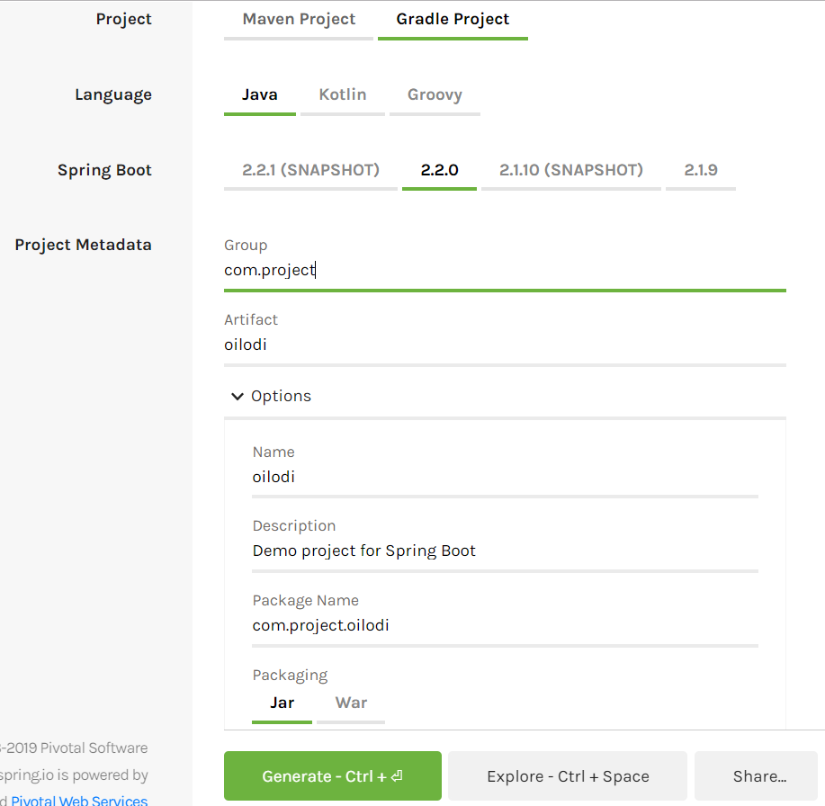
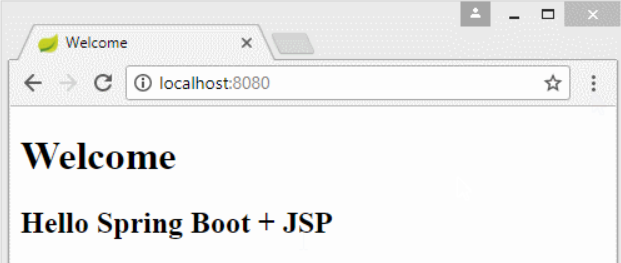

# oilNav
 최적 주유소 길안내 서비스

## Video


## INDEX

+ [ROLE](#ROLE)
+ [I. 개발환경-Development Envirenment](#I-개발환경-Development-Environment)
+ [II. 설정-Setup](#II-설정-Setup)
+ [III. 레이아웃-Layout](#III-레이아웃-Layout)
+ [IV.기능-Function](#IV-기능-Function)


## ROLE

| 팀장   | 기획                   | 개발                   | QA     |
| ------ | ---------------------- | ---------------------- | ------ |
| 박정원 | 김범현, 박정원, 이동규 | 김범현, 박정원, 이동규 | 박정원 |


## I. 개발환경-Development Environment


+ IDE : Eclipse
+ SpringBoot 2.2.0
+ bootstarp4
+ Java
+ Gradle
+ MariaDB
+ [AQueryTool](http://aquerytool.com/)
+ Windows


## II. 설정-Setup

##### 1. Go to [SpringBoot Initializr](https://start.spring.io/)



##### 2. Add Dependencies

+ Spring Web
+ Thymeleaf

##### 3. Generate and Unzip

##### 4. Import Gradle Project 


##### 5. Maria DB Setting in application.properties

```
    #datasource
    spring.datasource.driverClassName=org.mariadb.jdbc.Driver
    spring.datasource.url=jdbc:mariadb://localhost:3306/oilodi
    spring.datasource.username=root
    spring.datasource.password=password
```

##### 13. Go to http://localhost:8080/



## III. 레이아웃-Layout


## IV. 기능-Function


